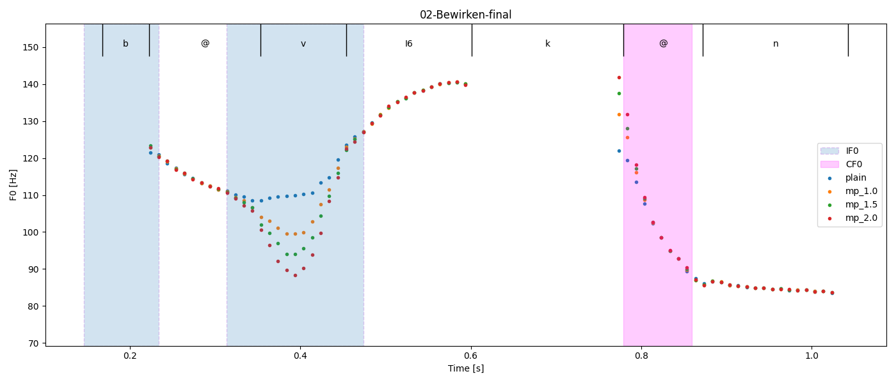

# Modelling microprosodic effects leads to an audible improvement in articulatory synthesis
This repository contains the suplementary material to the paper "Modelling microprosodic effects leads to an audible improvement in articulatory synthesis" by Krug et al. 


## What is this code for?
The code in this repository can be used to synthesize speech using the state-of-the-art articulatory speech synthesizer VocalTractLab<sup id="a1">[1](#f1)</sup> (VTL). Thereby, a given pitch contour can automatically be modified to include microprosodic deflections based on a microprosody model developed by Birkholz and Zhang<sup id="a2">[2](#f2)</sup>.



If the code in this repository is run without modification, it will reproduce the audio files that were used as stimuli in the listening experiment that is described in the paper "Modelling microprosodic effects leads to an audible improvement in articulatory synthesis" by Krug et al.

Thereby, the extent of pitch manipulation can be visualized, see the example above.


## Requirements
To run the code, you will need a Python 3 environment (tested with version 3.7) and following modules must be installed:
- numpy    (tested with version 1.19.5)
- pandas   (tested with version 1.2.1)
- scipy    (tested with version 1.6.0)

Optional, used for visualization:
- matplotlib        (tested with version 3.3.3)
- praat-parselmouth (tested with version 0.3.3)

You can install all these modules with the command:

``pip install -r requirements.txt``

## Running the code
In order to reproduce the plain and manipulated audio files, download this repository and navigate to the corresponding folder. Subsequently run:

``python Microprosody_Analysis.py --create_stimuli``

This will create the tract sequence and the audio files of 20 German utterances, each in four different versions: One file without pitch manipulation, and three files with pitch manipulation using the pitch amplitude factors 1.0, 1.5 and 2.0, respectively. The tract sequences will appear in the subfolder "/Stimuli/Tract_Sequences/" and the audio files will be placed in the subfolder "/Stimuli/Audio/" automatically.

In order to visualize the effect of pitch manipulation, run:

``python Microprosody_Analysis.py --visualize``

This will use a python implementation of PRAAT<sup id="a3">[3](#f3)</sup> to extract the pitch information from the produced audio samples and it will plot the pitch contour of the four different versions of each utterance on a single canvas. The phoneme sequence and the regions of the microprosodic effects will be extracted from the corresponding segment sequence file and will be plotted as well. The plots will be saved in the folder "/Figures/" that gets created automatically.


## File description

This repository contains the following important files and folders:
- `` Microprosody_Analysis.py`` The script to produce the audio samples and to visualize the pitch contour.
- ```PyVTL``` A package which allows to work with VTL functions within Python.

  ```└─── API``` Contains the VTL version 2.3 API files (for both Windows and Linux operating systems).
  
  ```└─── Speaker``` Contains the VTL version 2.3 speaker files.
  
  ```└─── F0_Manipulation.py``` A python module that allows to superimpose microprosodic effects onto a pitch contour.
  
  ```└─── PyVTL.py``` A python wrapper module for the VTL C++ functions.
  
- ```Stimuli``` Contains the segment sequences and gestural scores, as well as tract sequences and audio files once the script was run.

## Troubleshooting

If PyVTL can not load the path "./API/VocalTractLabApi.dll" or "./API/VocalTractLabApi.so", the API files might not work on your operating system. The ".dll" file was compiled on Windows 10 using Visual Studio 19 and the ".so" file was compiled on Ubuntu 16.04 using g++. If you are working on a different operating system, you might need to recompile the VocalTractLab version 2.3 API directly from the source code. For download and instructions, see: https://vocaltractlab.de/index.php?page=vocaltractlab-download


## How to cite this work

This work is distributed under the GNU GPL 3.0 License. If you use parts of this work in your own work, please cite the following reference:

- The information will follow shortly -

## References
<b id="f1">1</b> https://vocaltractlab.de/ [↩](#a1)

<b id="f2">2</b> [P. Birkholz and X. Zhang, “Accounting for microprosody in modeling  intonation,”  in Proc. of the International Conference on Acoustics, Speech and Signal Processing (ICASSP) (2020), pp.8099–8103.](https://vocaltractlab.de/publications/birkholz-2020-icassp.pdf) [↩](#a2)

<b id="f3">3</b> http://www.praat.org [↩](#a3)
